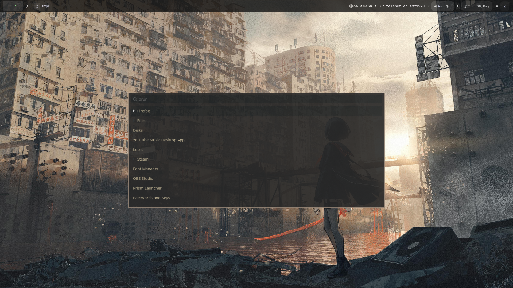
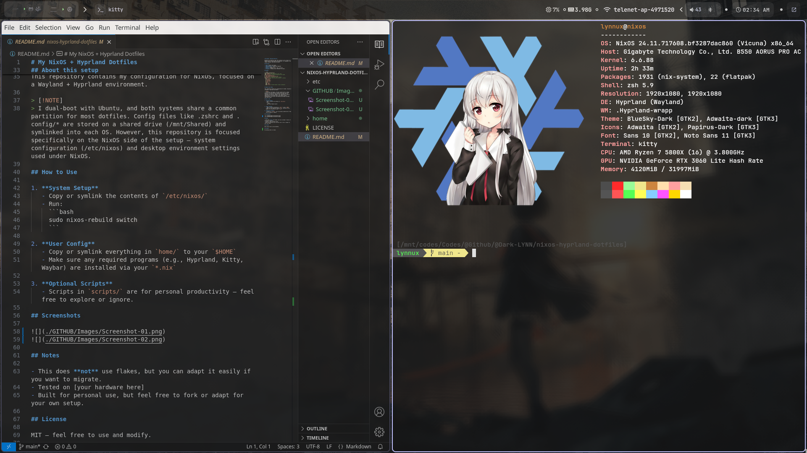

# My NixOS + Hyprland Dotfiles

Welcome to my dotfiles repo! This contains my full setup for a NixOS system running Hyprland and Wayland. It's designed to be simple, minimal, and easily portable.

## Overview

- **OS:** NixOS (non-flake)
- **WM/Compositor:** Hyprland (Wayland)
- **Shell:** Bash / Zsh
- **Extras:** Waybar, Kitty, Wofi, and more
- **Target:** Personal use, reference for others

## Layout

``` zsh
nixos-hyprland-dotfiles/
├── /GITHUB # Files Related to this repo.
├── /etc/nixos/ # System configuration for NixOS
│ ├── configuration.nix
│ ├── hardware-configuration.nix
│ └── modules/ # Optional: split configs
└── home/ # User-level dotfiles (mostly ~/.config)
  ├── .config/
  │ ├── hypr/
  │ ├── waybar/
  │ ├── kitty/
  │ └── ...
  ├── .bashrc
  ├── .zshrc
  └── scripts/ # Custom helper scripts (optional)
```

## About this setup

This repository contains my configuration for NixOS, focused on a Wayland + Hyprland environment.

> [!NOTE]
> I dual-boot with Ubuntu, and both systems share a common partition for most dotfiles. Config files like .zshrc and .config/* are stored on a shared drive (/mnt/Shared) and symlinked into each OS. However, this repository is focused specifically on the NixOS side of the setup — system configuration (/etc/nixos) and desktop environment settings used under NixOS.

## How to Use

1. **System Setup**
   - Copy or symlink the contents of `/etc/nixos/`
   - Run:
     ```bash
     sudo nixos-rebuild switch
     ```

2. **User Config**
   - Copy or symlink everything in `home/` to your `$HOME`
   - Make sure any required programs (e.g., Hyprland, Kitty, Waybar) are installed via your `*.nix`

3. **Optional Scripts**
   - Scripts in `scripts/` are for personal productivity — feel free to explore or ignore.

## Screenshots




## Notes

- This does **not** use flakes, but you can adapt it easily if you want to migrate.
- Tested on [your hardware here]
- Built for personal use, but feel free to fork or adapt for your own setup.

## License

MIT — feel free to use and modify.

## Credits

My configs used [] as base.